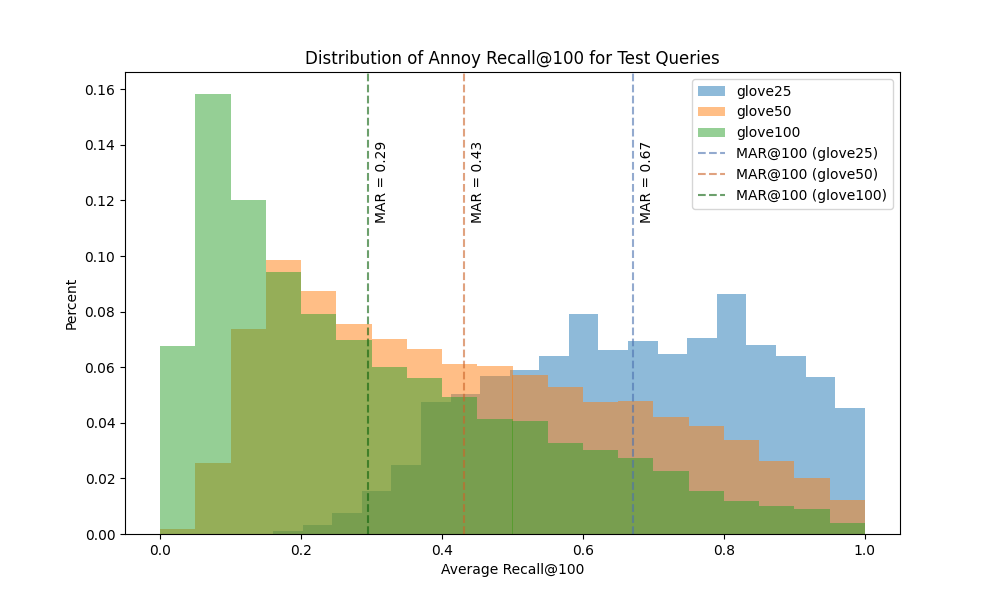

# Annoy Similarity Search Evaluation

This is a proof-of-concept evaluation of a popular Python (C++ under the hood!) library for Approximate Nearest Neighbors (ANN) similarity search. Its performance, as measured by [recall](https://en.wikipedia.org/wiki/Precision_and_recall#Recall), is measured for a few different datasets (see [below](#datasets))
- [Annoy (Spotify)](https://github.com/spotify/annoy)
  - Builds search index using a tree-based algorithm

The library below is utilized to perform a fast and efficient *exhaustive search* to produce ground truth nearest neighbors to measure recall against.
- [Faiss (Facebook)](https://github.com/facebookresearch/faiss)
  - Uses hash table with Locality Sensitive Hashing (LSH) as a search index

- Time permitting, it would also be nice to add other methods to the evaluation phase, such as Faiss
- Note that this study does *not* measure lookup speeds (ie queries/second) which is a major component of choosing a library to use for this type of task

## Datasets

- Info about the GloVe datasets can be found [here](https://nlp.stanford.edu/projects/glove/)
- Datasets used in this project are retrieved from the [ann-benchmarks](https://github.com/erikbern/ann-benchmarks) project and transformed further
  - glove25: GloVe with 25-dimensional embedding vectors
  - glove50: GloVe with 50-dimensional embedding vectors
  - glove100: GloVe with 100-dimensional embedding vectors


## Results

Each dataset contains a training set and a test set. The plot below shows the distribution of recall@100 (that is, recall when retrieving the 100 nearest neighbors) for each query vector in the test set of each dataset. The vertical line of the same color shows the Mean Average Recall (MAR@100) for the entire test set.



## Note on Methods


---

## Run It Yourself!

### 1. Download Datasets

Time: a couple minutes, depends on network.

```
sh download.sh
```

### 2. Preprocess Datasets

Time: 2-3 minutes

```
python preprocess.py
```

### 3. Build the Indexes

Time: 2-3 minutes

```
python build_indexes.py
```

### 4. Generate Results

Time: ~1 minute

```
python generate_results.py
```

### 5. Evaluate

Time: <1 minute

```
python evaluate.py
```


